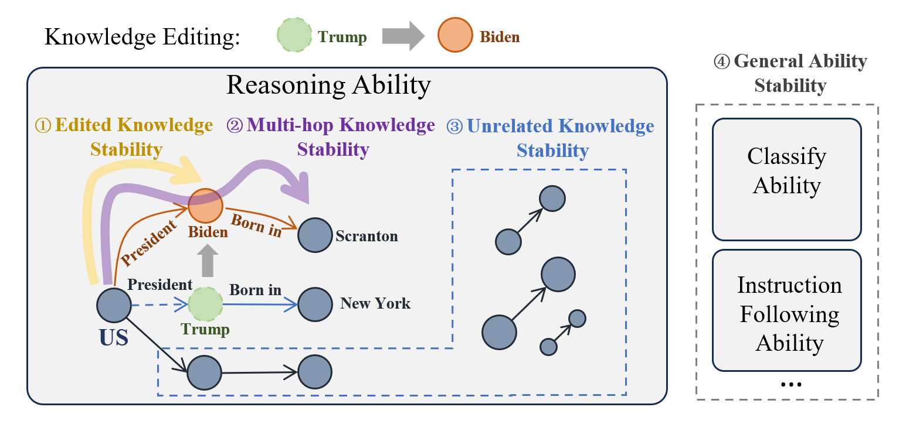

# StableKE

This is the repository for our paper [Stable Knowledge Editing in Large Language Models](https://arxiv.org/abs/2402.13048).

This paper introduces StableKE, a novel method for knowledge editing in large language models (LLMs), focusing on stability across multiple dimensions. 

StableKE incorporates Semantic Paraphrase Enhancement and Contextual Description Enrichment strategies to maintain edited, multi-hop, and unrelated knowledge stability, as well as general model capabilities. 

We introduce KEBench, a novel benchmark specifically designed for assessing knowledge editing methods. This benchmark rigorously evaluates the stability of edited knowledge, its ripple effects across multi-hop knowledge integration, the preservation of unrelated knowledge.

Please see [our paper](https://arxiv.org/pdf/2402.13048.pdf) for more details.



## Datasets

### Overview 
The KEBench datasets are included in `dataset/`. There are three files:
* `edited_knowledge.json`: Edited Knowledge Stability reflects the performance of one-hop knowledge editing, focusing on the consistency and accuracy of edited knowledge.
* `multi_hop_knowledge.json`: Multi-hop Knowledge Stability evaluates how well the edited knowledge integrates with existing knowledge across multiple steps.
* `unrelated_knowledge.json`: Unrelated Knowledge Stability ensures that unrelated knowledge remains unchanged despite the editing process.

## Data format

### Edited Knowledge
The dataset is saved as a list of dicts, each of which represents a data instance. An example in `edited_knowledge.json` is shown below.

```
{
  "first_question": "What is the country of citizenship of Paul Douglas?",
  "paraphrased_question": "What is Paul Douglas' nationality?",
  "old_prompt": "Paul Douglas is a citizen of United States of America.",
  "old_first_answer": "United States of America",
  "old_first_answer_aliases": ["US",…],
  "new_prompt": "Paul Douglas is a citizen of France.",
  "new_first_answer": "France",
  "new_first_answer_aliases": ["FR",…],
}
```
* `first_question`:  Generate using templates based on fact triples $t_1 = (s_1,r_1,o_1)$
* `papaphrased_question`: Based on the first question, the question has been paraphrased using ChatGPT while preserving semantic equivalence.
* `old_prompt`: Correct answer sentence before editing.
* `old_first_answer` and `old_first_answer_aliases`: Correct answer and its alias before editing.
* `new_prompt`: Correct answer sentence after editing.
* `new_first_answer` and `new_first_answer_aliases`: Correct answer and its alias after editing.

###  Multi Hop Knowledge
The dataset is saved as a list of dicts, each of which represents a data instance. An example in `multi_hop_knowledge.json` is shown below.

```
{
  "two_hop_question": "Who is the head of state of the country whose citizen is Paul Douglas?",
  "old_multi_hop_answer": "Joe Biden",
  "old_multi_hop_answer_aliases": ["Biden",…]
  "new_multi_hop_answer": "Emmanuel Macron",
  "new_multi_hop_answer_aliases": ["Macron",…],
}
```
* `two_hop_question`: A combination problem generated based on the first and second fact triples $t_1 = (s_1,r_1,o_1) & t_2 = (s_2, r_2, o_2)$and following the template.
* `old_multi_hop_answer` and `old_multi_hop_answer_aliases`: Correct answer and its alias before editing.
* `new_multi_hop_answer` and `new_multi_hop_answer_aliases`: Correct answer and its alias after editing.

###  Unrelated Knowledge
The dataset is saved as a list of dicts, each of which represents a data instance. An example in `unrelated_knowledge.json` is shown below.

```
{
  "old_second_question": "What is the name of the current head of state in United States of America?",
  "new_second_question": "What is the name of the current head of state in France?",
  "old_second_answer": "Joe Biden",
  "old_second_answer_aliases": ["Biden",…]
  "new_second_answer": "Emmanuel Macron",
  "new_second_answer_aliases": ["Macron",…],
}
```
* `old_second_question`: The question related to answer entities $o_1$ before editing.
* `new_second_question`: The question related to answer entities $o_1^*$ after editing.
* `old_second_answer` and `old_second_answer_aliases`: The answer to old_second_question and its alias.
* `new_second_answer` and `new_second_answer_aliases`: The answer to new_second_question and its alias.


## Evaluation


We include evaluation setups that we use in our paper.

### Edited facts (single-hop)
For a single-hop problem, you can test the results output by the model by running the following code.
```
python stableke/code/evaluate/edited_knowledge_check.py
```
### Multi-hop questions (including CoT)
For multi-hop problems that include COT, you can test the model results by running the following code.
```
python stableke/code/evaluate/multi_hop_knowledge_check.py
```
### Unrelated facts (single-hop)
For unrelated questions, you can test the model results by running the following code.
```
python stableke/code/evaluate/unrelated_knowledge_check.py
```
## Acknowledgments
We would like to express our gratitude to the projects, research and development personnel associated with a portion of the MQuAKE dataset utilized in this project.
- [MQuAKE Github](https://github.com/princeton-nlp/MQuAKE)
- [MQuAKE Paper](https://arxiv.org/abs/2305.14795)

## Citation
If you use our code or dataset in your research, please cite our work:


```bibtex
@misc{wei2024stable,
      title={Stable Knowledge Editing in Large Language Models}, 
      author={Zihao Wei and Liang Pang and Hanxing Ding and Jingcheng Deng and Huawei Shen and Xueqi Cheng},
      year={2024},
      eprint={2402.13048},
      archivePrefix={arXiv},
      primaryClass={cs.CL}
}
```
